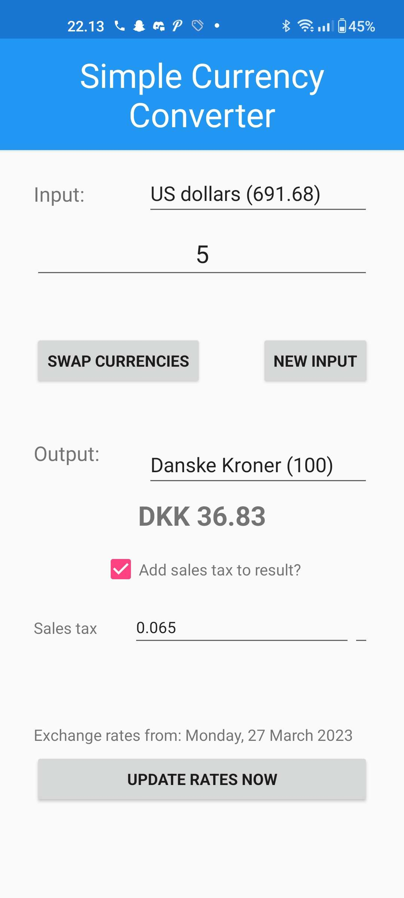

# Simple Currency Converter

This is a very simple Xamarin App (for Android, but I guess you're welcome to adapt it to iOS).

The app is a simple currency converter. It uses data from the [danish national bank](https://www.nationalbanken.dk/valutakurser), so all the currencies are based off the Danish Krone (DKK). But I guess the app can be used by anyone. 

It's hastely made so it's very hacky-hacky and not that nicely made. But it's just meant to work, nothing more. I made the app because I wanted a currency-converter app that worked offline and with no ads. Couldn't find any on the Google Playstore. There's probably multiple apps like that on the Playstore, but I guess I didn't search long enough.
